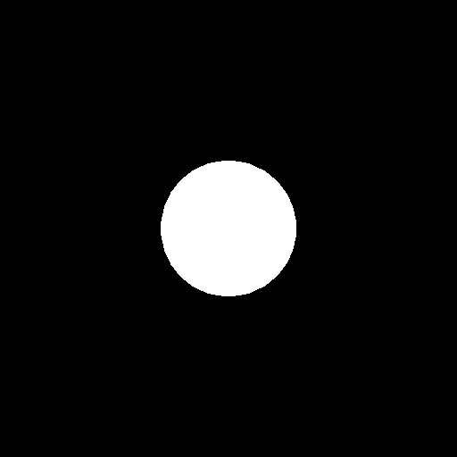

# Assignment 4 - Rasterization Pipeline

## Overview
This repository contains the implementation of a simple rasterization pipeline used to draw a shaded sphere with multiple triangles. This project is part of the Spring 2024 Computer Graphics and Image Processing course. The implementation is done in Python and utilizes a custom rasterizer to handle transformations and display of a shaded sphere.

## File Descriptions

- `assignment4_unshaded.py`: This Python script contains the implementation for generating a rasterized sphere without shading (unshaded). It involves transformations such as modeling, camera setup, perspective projection, and viewport transformation. It uses a custom rasterizer written from scratch to process the generated triangles of the sphere.

- `rasterized_sphere.png`: This image file shows the output of the `assignment4_unshaded.py` script, which is the rasterized view of an unshaded sphere.

## Setup and Execution

### Prerequisites
- Python 3.9.5
- NumPy library
- PIL library (Pillow)

### Installation
To set up your environment to run this script, follow these steps:

1. Install Python 3.9.5 from the [official Python website](https://www.python.org/downloads/release/python-395/).
2. Install the required Python packages using pip:
   ```bash
   pip install numpy pillow
   ```

### Running the Script
1. Ensure that Python and the necessary libraries (NumPy and Pillow) are installed on your machine.
2. Clone this repository or download the files to your local machine.
3. Navigate to the directory containing `assignment4_unshaded.py`.
4. Run the script using the following command:
    ```bash
    python assignment4_unshaded.py
    ```
5. The output image `rasterized_sphere.png` will be generated in the same directory, showing the rasterized sphere as specified in the assignment requirements.

## Output
Below is the output from the script, showing the unshaded rasterized sphere:



## Implementation Details
The script `assignment4_unshaded.py` performs the following operations:
1. **Modeling Transformation**: Translates and scales the unit sphere to the specified position and size.
2. **Camera Transformation**: Sets the camera position and orientation based on the given specifications (eye at the origin, looking along the negative z-axis).
3. **Perspective Projection**: Applies a perspective projection transform to simulate a realistic viewing perspective with a specified field of view.
4. **Viewport Transformation**: Maps the 3D points after projection to screen coordinates.
5. **Rasterization**: Converts the triangles into pixel representations on the screen while handling occlusion through a depth buffer (Z-buffer algorithm).

The image is generated without any shading, displaying the geometry processed by the transformations and rasterization stages.

## Additional Libraries
This project uses the following Python libraries:
- `NumPy`: Used for efficient numerical computations, especially for handling arrays and matrices.
- `Pillow (PIL)`: Used for creating and saving images.

## License
This project is licensed under the MIT License - see the [LICENSE.md](LICENSE.md) file for details.

Feel free to contact me for any questions or if you encounter issues with the implementation.
