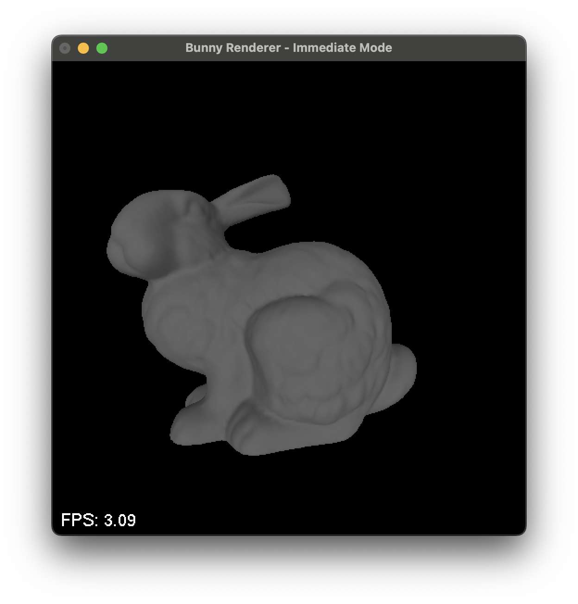

# Programming Assignment 5
## Computer Graphics and Image Processing
### Spring 2024

In this programming assignment, you will use OpenGL to render a bunny. A sample screenshot is provided below.

### Triangle Mesh

The bunny is provided as a triangle mesh in .obj format, downloadable from the course webpage. The bunny is represented using 69,451 triangles. Sample code to load the triangle mesh from the .obj file is also provided on the course webpage. This code is written in C++, so if you’re using a different language, you will have to make the necessary translations.

### Transform Parameters

While rendering the bunny, use the following transformations:
- Scale the bunny uniformly by a factor of 10 in all directions, and then translate its origin to the position (0.1, −1, −1.5).
- Position the camera at e = (0, 0, 0), with coordinate axes u = (1, 0, 0), v = (0, 1, 0), and w = (0, 0, 1).
- Use perspective projection, with l = −0.1, r = 0.1, b = −0.1, t = 0.1, n = −0.1, and f = −1000. (Note that OpenGL reverses the signs of n and f.)
- Use a viewport transform with nx = ny = 512.

### Shading Parameters

For hidden surface elimination, use a depth buffer, but disable back-face culling. Render the bunny using OpenGL’s fixed-function shading pipeline, with the following parameters:
- Assume the bunny has ka = kd = (1, 1, 1). Assume it is not specular, i.e., ks = (0, 0, 0) and p = 0.
- Assume an ambient light intensity of Ia = (0.2, 0.2, 0.2).
- Add a single directional light source with ambient color (0, 0, 0), diffuse color (1, 1, 1), and specular color (0, 0, 0). Assume the light strikes every point along the direction (−1, −1, −1) (normalized, of course). (Hint: You will have to set the position of the light to a homogeneous vector with w = 0.)

### Rendering

This assignment consists of 2 parts:

1. **Immediate Mode**
   - Render the bunny using OpenGL’s immediate mode. In other words, specify triangles to OpenGL using glVertex3f and glNormal3f every frame.

2. **Vertex Arrays**
   - Now create a vertex array object (VAO). Bind it to one or more vertex buffer objects (VBOs) containing the position and normal data for each vertex. (You are free to store this information any way you like.) Also, create a buffer to store triangle indices. Copy all the data to GPU memory before you start rendering, and render the bunny using glDrawElements.

In each case, measure how long it takes to render the bunny. There is code provided on the course webpage that will automatically update the title of your GLUT window with an FPS counter. Report ballpark values of this counter for each case in your README.

### Files

- `hw5_1.py`: Implementation of Immediate Mode.
- `hw5_1.png`: Result image of `hw5_1.py`.
- `hw5_2.py`: Implementation of Vertex Arrays (currently incomplete).

### Execution Environment

- Operating System: OSX
- Python Version: 3.9.5

### Required Packages

To install the required packages, run the following commands:

```bash
pip install PyOpenGL PyOpenGL_accelerate PyGLUT numpy glfw pywavefront
```

### Execution Instructions

To run the Immediate Mode implementation:

```bash
python hw5_1.py
```

This will render the bunny using OpenGL’s immediate mode and display the result in a window. The `hw5_1.png` file shows an example of the expected output.

For the Vertex Arrays implementation (once completed), you would similarly execute:

```bash
python hw5_2.py
```

This will render the bunny using Vertex Arrays and display the result.

### Results

- **Immediate Mode:** Refer to `hw5_1.png` for a screenshot of the rendered bunny.


- **Vertex Arrays:** Currently incomplete. Update this section once `hw5_2.py` is completed and results are obtained.

